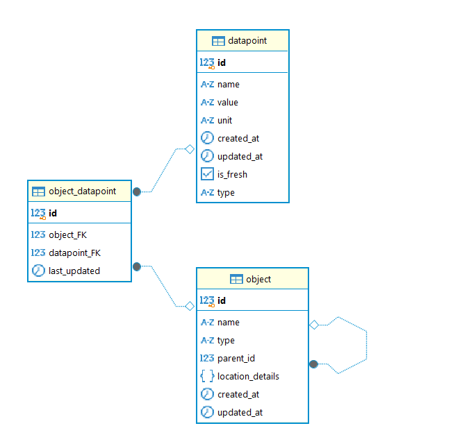
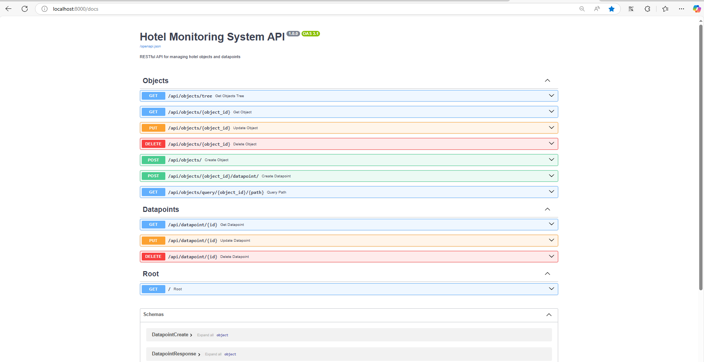
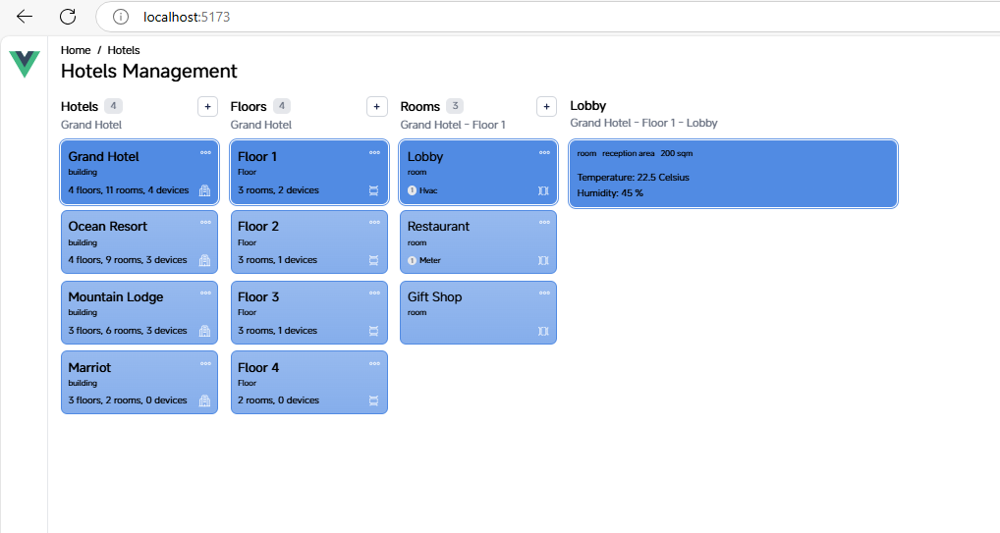

# beezfm_hotels_management
Components of Beezfm Hotels Management mock project.

This project consists of 3 components. Please refer to these 3 repositories for the source codes and detailed implementation: 

1. [Database](https://github.com/trixt63/beezfm_database)
2. [Backend](https://github.com/trixt63/beezfm_backend)
3. [Frontend](https://github.com/trixt63/beezfm_frontend)

Next, here is the outline of my solution for the assigment.

## 1. [Database](https://github.com/trixt63/beezfm_database)

The Postgresql database design includes three entities: `datapoint`, `object_datapoint`, and `object`. The datapoint entity stores metrics like temperature. The object entity represents entities like rooms or devices, with a hierarchical structure. The object_datapoint junction table creates a many-to-many relationship between objects and datapoints using foreign keys, tracking updates. This supports the hotel monitoring system's data management.

The "type" columns on `datapoint` and `object` exist to serve the querying by nested path (e.g. `building.floor.room.temperature`) function.

## 2. [Backend](https://github.com/trixt63/beezfm_backend)

I have developed backend APIs for CRUD operations on Objects and Datapoints, enabling creation, retrieval, updating, and deletion of these entities. 

I also implemented a query-by-path API that retrieves all objects and datapoints matching a nested path. For instance, querying from the "Grand Hotel" object with the path "building.floor.room.temperature" returns all temperature datapoints for rooms within the "Grand Hotel" hierarchy.

## 3. [Frontend](https://github.com/trixt63/beezfm_frontend)

I have developed a frontend interface using React that displays the hierarchical structure of objects, such as hotels, floors, and rooms, in an intuitive manner. The UI allows users to navigate through the hierarchy and view associated datapoints, like temperature and humidity, in real-time. For example, selecting "Grand Hotel" reveals its floors, rooms, and datapoints like "Lobby" with a temperature of 22 Celsius and humidity of 45%. 

However, I have not yet implemented CRUD operations in the UI to allow users to create, update, or delete objects and datapoints directly from the interface.